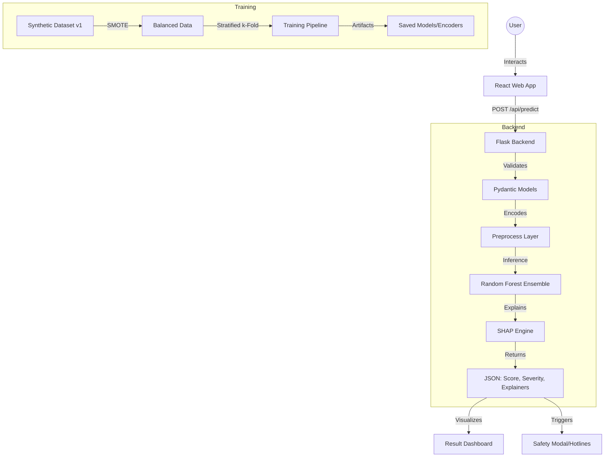

# 🧠 AI Depression Predictor (Professional Edition)

[](https://www.docker.com/)
[](https://www.who.int/health-topics/depression)
[](https://opensource.org/licenses/MIT)

A production-grade, ethical, and explainable mental health assessment tool designed to lower the barrier for seeking help through AI-driven insights and conversational UI.

## 🗺️ Architecture Overview



## 🛠️ Tech Stack & Key Features

- **Frontend**: React 18, Tailwind CSS (Dual Theme), Framer Motion, Lucide Icons.
- **Backend**: Flask, Pydantic (Validation), SHAP (Explainability).
- **ML Engine**: Scikit-Learn (Random Forest Ensemble), Imbalanced-Learn (SMOTE).
- **Ethics & Safety**: Context-aware Crisis resources, Medically-reviewed disclaimers, Privacy-first ephemeral processing.

## 🚀 Quick Start (Dockerized)

Ensure you have [Docker](https://www.docker.com/) installed.

1. **Clone & Spin up**:
   ```bash
   git clone https://github.com/yash23082007/ai-depression-predictor.git
   cd ai-depression-predictor
   docker-compose up --build
   ```
2. **Access**:
   - Frontend: `http://localhost:3001`
   - Backend API: `http://localhost:5001`

## 🔬 Research Context & Methodology

### Dataset Disclosure
This application uses **Synthetic Dataset v1** (25,000 records). While the patterns are modeled after common academic and occupational stressors, the predictions are strictly based on synthetic patterns and **should not be used as a clinical diagnosis.**

### Model Optimization
- **Ensemble Approach**: Uses a Random Forest Classifier cross-validated with `StratifiedKFold`.
- **Imbalance Handling**: Employs **SMOTE** (Synthetic Minority Over-sampling Technique) to ensure the model sensitively detects depressive indicators even when they are underrepresented in raw data.
- **Explainability**: Integrated **SHAP** (Shapley Additive Explanations) to provides per-prediction transparency, showing users exactly which lifestyle factors influenced their specific score.

## ⚠️ Limitations & Ethical Boundaries
- **Non-Diagnostic**: This tool provides a pattern-based check-in, not a medical result.
- **Regional Bias**: Currently optimized for academic/student lifestyle patterns.
- **Data Privacy**: All processing is ephemeral. User data is not sold or shared.

## 🧪 Testing
Run the comprehensive safety and validation suite:
```bash
cd server
pytest
```

---
**Developed with ❤️ by Yash Vijay**  
*The goal is not to replace clinical care, but to make it easier to start the conversation.*
