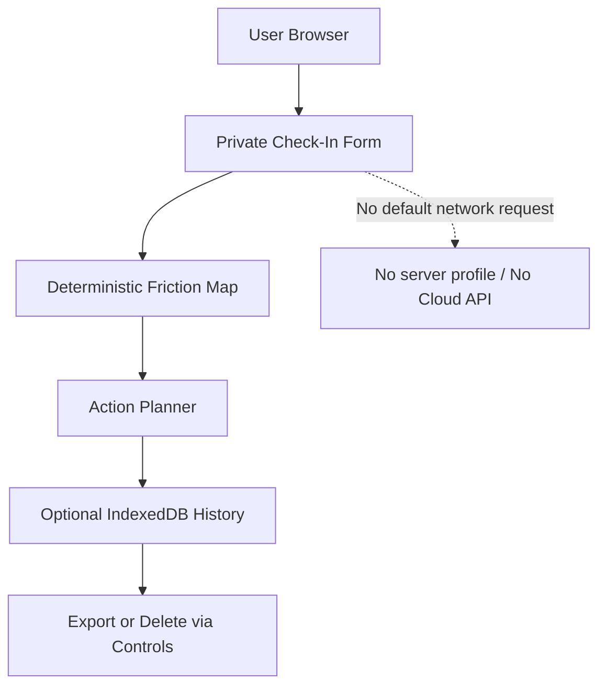

# MindCheck

MindCheck is a highly sophisticated, local-first progressive web application (PWA) engineered to provide private wellbeing reflection. It is built to ensure absolute data sovereignty, with an architectural model that guarantees sensitive user check-in data never traverses a network or persists to a cloud server.

> [!CAUTION]
> **Not a Diagnostic Tool**
> MindCheck is strictly a self-reflection tool. It is not a medical assessment, clinical screening tool, or a suicide-risk detector. It does not provide medical diagnoses or therapy.

---

## 🏗️ Architecture & Technology Stack

MindCheck operates on a strict **local-first** paradigm, constructed as a static SPA (Single Page Application) that relies solely on the client browser for compute and storage.

- **Frontend Core:** React 18
- **Build & Bundling:** Vite
- **Routing:** React Router DOM
- **Styling:** Tailwind CSS
- **Animation:** Framer Motion (with strict `prefers-reduced-motion` compliance)
- **Local Persistence:** IndexedDB (via the `idb` library)
- **PWA Configuration:** `vite-plugin-pwa` for service worker generation and offline caching

### System Flow

```mermaid
flowchart TD
    U[User Browser] --> Q[Private Check-In Form]
    Q --> F[Deterministic Friction Map]
    F --> A[Action Planner]
    A --> L[Optional IndexedDB History]
    L --> E[Export or Delete via Controls]

    Q -. No default network request .-> N[No server profile / No Cloud API]
```

---

## 🔒 Privacy & Safety Model

MindCheck was deliberately engineered against standard data-collection patterns to protect highly sensitive reflection data.

### Local-First Privacy
1. **Zero Network Transmission:** Form answers are processed synchronously in the DOM. No `fetch` or `XHR` requests transmit answers to an API.
2. **Opt-in Only Storage:** By default, nothing is saved to `localStorage` or `IndexedDB`. A user must explicitly click "Save this reflection locally" to persist data to their own device.
3. **No Analytics:** The application forbids event trackers (e.g., Google Analytics, PostHog) or form recording tools that might accidentally scrape DOM state.

### The Safety Route
MindCheck prioritizes user safety over engagement. If a user selects an answer indicative of severe distress or self-harm:
- The standard assessment flow is immediately interrupted.
- A **Safety Support Panel** is rendered, linking to verified global and local crisis resources (e.g., 988, Befrienders Worldwide).
- To prevent accumulating a "crisis history", any check-in containing a safety trigger is explicitly blocked from being saved to the local IndexedDB.

---

## 🧠 Core Systems

### Deterministic Friction Map
Unlike "AI depression predictors" that rely on opaque scoring mechanisms or stochastic ML models, MindCheck utilizes a **Deterministic Friction Map**. User inputs are mapped exactly to readable friction labels (e.g., "You selected a recent low-energy difficulty"), ensuring the assessment is entirely explainable and never masquerades as a clinical algorithm.

### Action Planner & Personal Patterns
The Action Planner filters a static library of non-medical, manageable steps (e.g., "Take a two-minute reset", "Make one task smaller").
If a user saves their reflection, they can provide feedback on the action ("Helped", "Neutral", "Did not help"). Over time, the "My Data" control panel surfaces personal patterns based purely on local aggregations of this feedback.

---

## 🚀 Getting Started

To run the project locally or prepare a build for deployment:

### Installation
```bash
# Clone the repository and install dependencies
npm install
```

### Development Server
```bash
# Starts the Vite dev server with Hot Module Replacement (HMR)
npm run dev
```

### Production Build & Bundle Analysis
```bash
# Compiles the application to the /dist folder
npm run build

# To analyze the production bundle footprint (opens a Treemap visualizer)
npm run analyze
```

---

## 🧪 Testing

MindCheck is verified through a combination of unit tests and end-to-end browser tests to guarantee privacy invariants.

1. **Unit Tests (Vitest):**
   ```bash
   npm test
   ```
   Validates the deterministic mappings, action planners, and local storage adaptors.

2. **E2E Tests (Playwright):**
   ```bash
   npx playwright test
   ```
   Ensures that:
   - Network payloads do not contain sensitive data.
   - The safety flow correctly interrupts the assessment.
   - The application is navigable via keyboard and accessible to screen readers.

---

## 🚢 Deployment

Because MindCheck is a static PWA without backend dependencies, it can be hosted on any static edge network (Vercel, Netlify, Cloudflare Pages, GitHub Pages).

Simply configure your provider to:
- Run the build command: `npm run build`
- Publish the directory: `dist/`
- **Crucial:** Enable URL rewrite rules to point all non-file `/*` requests back to `/index.html` to allow React Router to handle client-side routing.

---

## ♿ Accessibility 

We adhere to rigorous WCAG standards:
- **Keyboard Navigation:** Every actionable element is reachable and operable via the `Tab` and `Enter` keys.
- **Screen Readers:** Generous use of `aria-live="assertive"` (for safety panels) and semantic HTML tags.
- **Reduced Motion:** All Framer Motion animations automatically disable if the user's OS has `prefers-reduced-motion` enabled.
- **Color Contrast:** Curated palettes ensure AA contrast compliance without relying on color alone to convey meaning.
